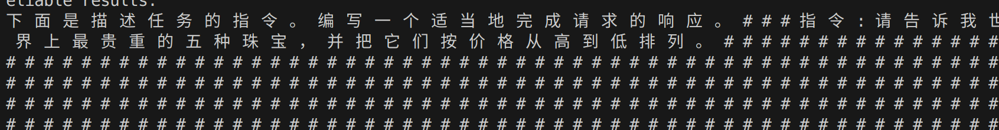
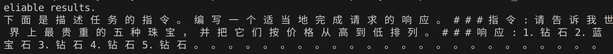

## 本项目基于 HuggingFace 的中文 GPT2 模型 uer/gpt2-chinese-cluecorpussmall，通过 指令微调（Instruction Tuning） 技术，训练一个能够理解指令并生成合理回答的中文语言模型。

## 📌 项目流程概览
✅ 下载并缓存模型（执行 load_model.py）

✅ 下载或准备数据集（执行 prepare_dataset.py，已有数据时可跳过）

✅ 开始微调训练（执行 train.py）

✅ 推理测试（执行 run_inference.py）
## 目录
```
gpt2-instruction-finetune/
├── scripts/
│   ├── load_model.py           # 下载预训练模型到本地
│   ├── prepare_dataset.py      # 处理并保存 JSON 格式指令数据
│   ├── train.py                # 微调训练主脚本
│   ├── run_inference.py        # 推理测试脚本
│   └── build_dataset.py        # 自定义 Dataset 加载器
├── utils/
│   └── formatting.py           # 格式化输入和自定义 collate_fn
├── models/                     # 预训练模型缓存目录
├── data/                       # 指令数据集存储目录
├── saved_model/                # 微调后模型保存目录
└── README.md
```
## 示例数据格式（JSON）
{
  "instruction": "请将下面这段话翻译成英文",
  "input": "人生若只如初见，何事秋风悲画扇",
  "output": "If life were only as it was at first sight, why should the autumn wind be sad over a painted fan?"
}
每一条数据由三部分组成：

instruction：用户指令

input：输入内容（可为空）

output：预期模型回答

## 安装依赖
conda create -n gpt2-instruction python=3.10 -y
conda activate gpt2-instruction
pip install -r requirements.txt

## 使用指南
```
python scripts/load_model.py
模型将缓存到 ./models/gpt2-chinese/ 目录。
python scripts/prepare_dataset.py
处理好的文件保存为：data/belle_10k_random_array.json，若已存在可跳过。
python scripts/train.py
训练完成后模型将保存在：saved_model/
python scripts/run_inference.py
```
## 微调前

## 微调后

